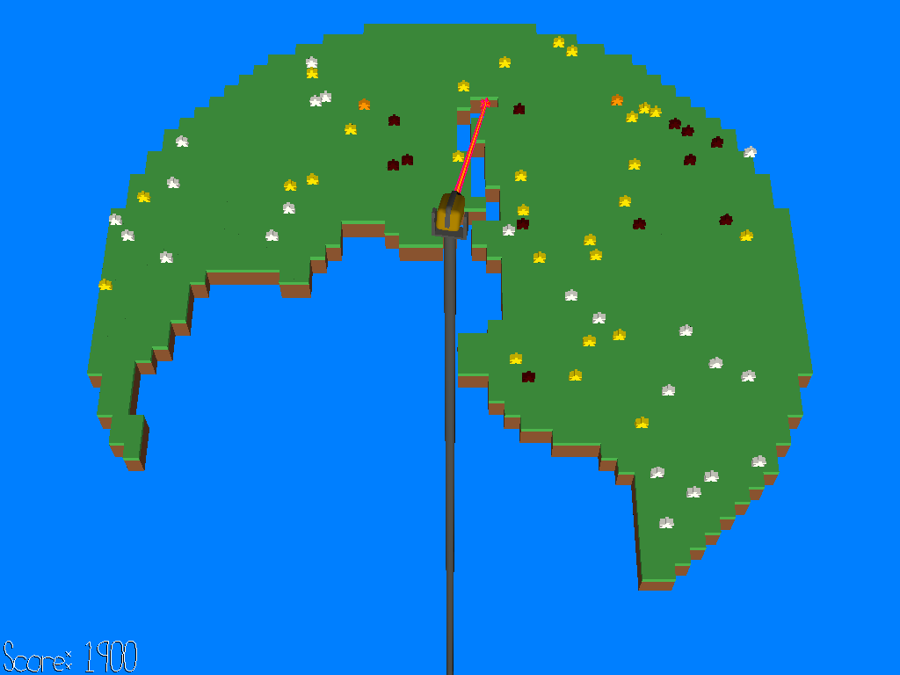

# Extreme Beam Quarantine

Author: Greg Loose

Design: Extreme Beam Quarantine is a top-down "shooter" game inspired (very loosely) by Qix (1981). You control a laser cannon mounted at the center of a floating island on the precipice of a pandemic, with the goal of slicing the island into pieces to separate the healthy from the infected.

Screen Shot:

## How To Play:

### Controls

* WASD: move the laser target
* R: reset game with same difficulty
* 1-9: reset game with different difficulty

### Description

At the start of the game, the island is covered with meeples (board-game-inspired pieces representing people), some healthy (white) and some infected (dark red). By moving the cursor with WASD, you can carve a path through the map, destroying ground tiles (and meeples) as you go. Upon completing a slice through the map into disjoint pieces, the smaller chunks will fall off the screen. Doing so will award points as follows:

* If every meeple in a chunk is healthy, you receive 100 points per meeple.
* If even ONE meeple in a chunk is infected (dark red), you receive 50 points per meeple.
* For every meeple that you kill with the beam (that is, directly hit the tile they're standing on), you LOSE 200 points.

In other words, the goal of the game is to partition the map into chunks such that each chunk contains only healthy meeples or only sick meeples, with more points awarded for healthy meeples. However, you must do so quickly, as infected meeples will spread the disease to those nearby. Each healthy meeple's progress towards infection is indicated by their color, going from white to yellow to orange to bright red, and finally to dark red.

The game ends when you have sliced up the entire map, or when the last chunk of the map becomes completely infected. Try to score as many points as you can!

### Tips
* You earn a "grade" for your performance, representing the ratio of your current score to the best possible score you could have earned based on the number of meeples that have been quarantined, killed, or infected. If you can play perfectly, you'll earn the coveted SS rating!
* "Difficulty" refers to the number of meeples generated on the map, ranging from 60 (at level 1) to 150 (at level 9). No matter which difficulty you play on, 10% of the meeples will be infected at the start. I did most of my playtesting at levels 1-5, though I have tried level 9 and found it very challenging. This is a difficult game, even at level 1; there's no shame in staying there if you want to go for a good grade!
* Keep an eye on your meeple colors! A group of orange and red meeples can quickly turn into a devastating outbreak. Try separating them from the infected before it can get to that point.
* Sick meeples move more quickly than healthy ones, making them difficult to catch. If a decent opportunity presents itself, it is often worth it to catch a few healthy meeples along with a sick one just to take it out of play.
* Meeples move from tile to tile at a rhythmic pace, and tend to prefer moving in the same direction as they have previously. This allows you to predict their movements and avoid killing them by destroying a tile as they are jumping to it.
* When you complete a slice through the map, the logic is actually a bit more complicated than "the smaller chunks fall off the screen". Specifically, one chunk is chosen to remain while all other non-contiguous chunks are dropped. In general, the remaining chunk is the one with the largest meeple population; however, any chunk containing only healthy or only sick meeples will always be dropped, even if it is otherwise the largest chunk, in which case the next largest chunk will be chosen instead.

This game was built with [NEST](NEST.md).
