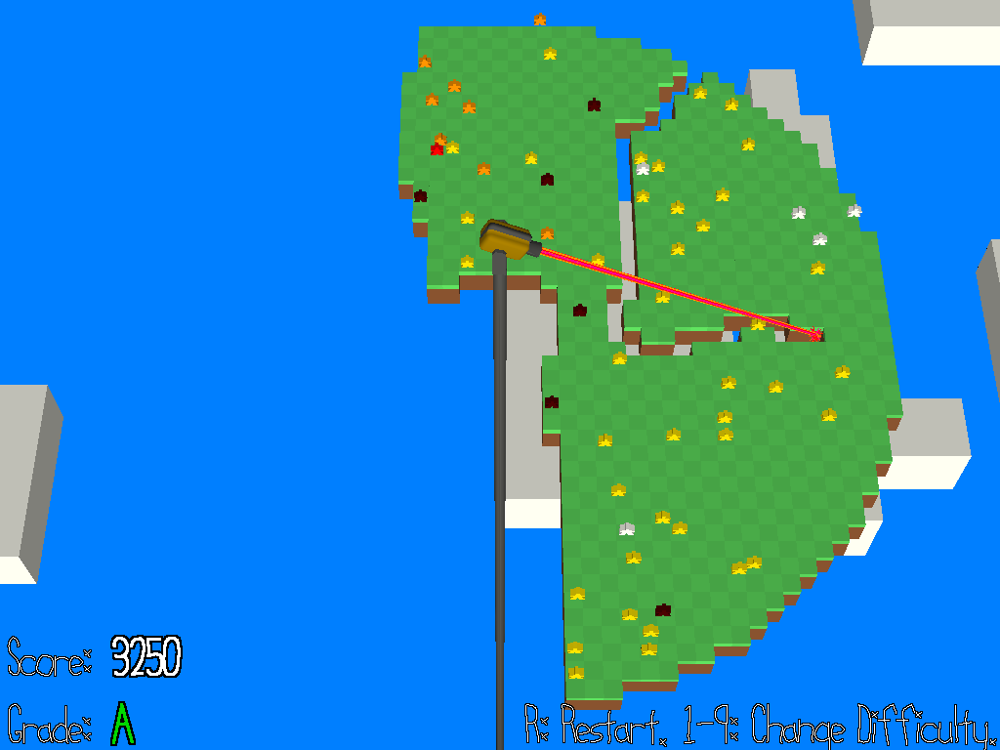

# Extreme Beam Quarantine

Author: Greg Loose

Design: Extreme Beam Quarantine is a top-down "shooter" game loosely inspired by Qix (1981). You control a laser cannon mounted at the center of a floating island on the precipice of a pandemic, with the goal of slicing the island into pieces to separate the healthy from the infected.

Screen Shot:

How To Play:

At the start of the game, the island is covered with meeples (board-game-inspired pieces representing people), some healthy (white) and some infected (dark red). By moving the cursor with WASD, you can carve a path through the map, destroying ground tiles (and meeples) as you go. Upon completing a slicing the map into disjoint pieces, the smaller chunks will fall off the screen. Doing so will award points as follows:

* If every meeple in a chunk is healthy, you receive 100 points per meeple.
* If even ONE meeple is infected (dark red), you receive 10 points per meeple.
* For every meeple that you hit with the beam (that is, destroy the tile they're standing on), you LOSE 200 points.

In other words, the goal of the game is to partition the map into chunks such that each chunk contains only healthy meeples or only sick meeples, with more points awarded for healthy meeples. However, you must do so quickly, as infected meeples will spread the disease to those nearby. Each healthy meeple's progress toward infection is indicated by their color, going from white to yellow to orange to bright red, and finally to dark red.

This game was built with [NEST](NEST.md).
